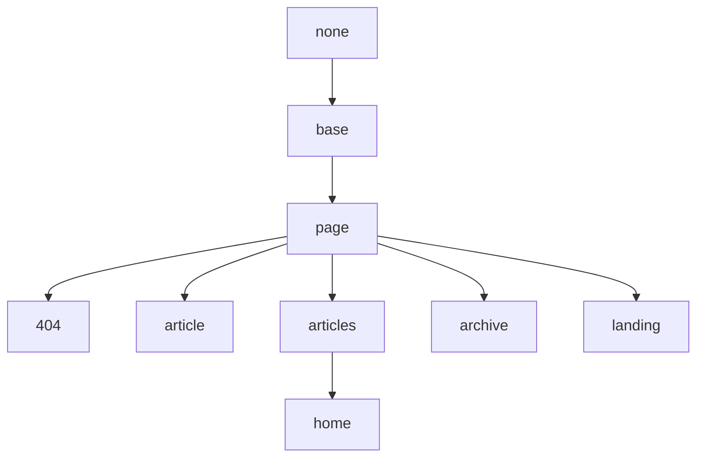

## Base Layout

Base on None.

## Page Layout


Base on Base Layout.

| Variable          | Wartości opcji        | Opis | Minimum Version |
| ---               | ---                   | ---         | ---     |
| **mode**          | normal (default), immersive | mode of the page. | 2.2.0 |
| **type**          | webpage (default), article | typ strony używany przez znaczniki [schema.org](https://schema.org/). | |
| **key**           | `!!str`               | Unikalny klucz do wpisu, wymagany przez Komentarze i Pageview. Muszą się zaczynać od litery (`[A-Za-z]`), po których może następować dowolna liczba liter, cyfr (`[0-9]`), łączników (`-`), podkreśleń (`_`), dwukropków ((`:`) i kropek (`.`). | |
| **lang**          | en (default), zh, zh-Hans, zh-Hant | Język tej strony. | |
| **author**        | `!!map`               | Przypisz jednego z autorów w pliku *authors.yml* do posta lub strony, zobacz [Autorzy](https://kitian616.github.io/jekyll-TeXt-theme/docs/en/authors), aby uzyskać szczegółowe informacje. | 2.2.0 |
| **show_title**    | true (default), false | Ustaw `false`, aby ukryć tytuł na tej stronie. | |
| **show_edit_on_github** | true, false (default) | Ustaw `false`, aby wyświetlić przycisk „Edytuj na Githubie”. najpierw musisz ustawić `repository` i `repository_tree` w *_config.yml*. | |
| **show_date**     | true (default), false | Ustaw `false`, aby ukryć aby ukryć datę na tej stronie. | 2.2.0 |
| **show_tags**     | true (default), false | Ustaw `false`, aby ukryć tagi na tej stronie. | 2.2.0 |
| **full_width**    | true, false (default) | Ustaw `true`, aby główna strona miała pełną szerokość. | |
| **pageview**      | true, false (default) | Ustaw `true`, aby włączyć pageview na tej stronie. | 2.2.0 |
| **comment**       | true (default), false | Ustaw `false`, aby aby wyłączyć komentarze na tej stronie. | |
| **mathjax**       | true, false           | Ustaw `true`, aby włączyć Mathjax na tej stronie. | |
| **mathjax_autoNumber** | true, false      | Ustaw `true`, aby włączyć Mathjax autoNumber na tej stronie. | |
| **mermaid**       | true, false           | Ustaw `true`, aby włączyć Mermaid na tej stronie. | |
| **chart**         | true, false           | Ustaw `true`, aby włączyć Wykresy na tej stronie. | |
| **cover**         | `!!str`               | Adres URL obrazu okładki. | 2.2.0 |
| **header**        | false, `!!map`        | Ustaw `false` to aby ukryć nagłówek na tej stronie. | 2.2.0 |
| **article_header**| `!!map`               | | 2.2.0 |
| **aside**         | `!!map`               | | |
| **sidebar**       | `!!map`               | | |
| **footer**        | false                 | Ustaw `false`, aby ukryć stopkę na tej stronie. | 2.2.3 |
| **lightbox**      | true, false           | Ustaw `true` aby włączyć lightbox (modalną galerię obrazów) dla dużych obrazów na tej stronie, możesz ustawić nazwę klasy `lightbox-ignore` , aby ignorować określony obraz. | 2.2.4 |


### header

| Variable          | Wartości opcji        | Opis |
| ---               | ---                   | ---         |
| **theme**         | light, dark           | |
| **background**    | `!!str`               | Dostępne, gdy określono motyw. |

### article_header

| Variable          | Wartości opcji        | Opis |
| ---               | ---                   | ---         |
| **type**          | overlay, cover        | |
| **align**         | left (default), center| |
| **theme**         | light (default), dark | |
| **background_color** | `!!str`            | Dostępne, gdy typem jest `overlay`. Jeśli ustawiony na ciemny kolor, musisz ustawić motyw jako 'dark'. |
| **background_image** | `!!map`            | Dostępne, gdy typem jest `overlay`, możesz ustwić `false`, by chcesz nadpisać `cover` aby wyłączyć obraz tła. |
| **image**         | `!!map`               | Dostępne, gdy typem jest`cover`. |
| **actions**       | `!!seq`               | |

### article_header.background_image

| Variable          | Wartości opcji        | Opis |
| ---               | ---                   | ---         |
| **gradient**      | `!!str`               | |
| **src**           | `!!str`               | Domyślnie `cover` |

### article_header.image

| Variable          | Wartości opcji        | Opis |
| ---               | ---                   | ---         |
| **src**           | `!!str`               | |

### aside

| Variable          | Wartości opcji        | Opis |
| ---               | ---                   | ---         |
| **toc**           | true, false           | Ustaw `true` by włączyć Spis treści na boku tej strony. |

### sidebar

| Variable          | Wartości opcji        | Opis |
| ---               | ---                   | ---         |
| **nav**           | `!!str`               | |

## Article Layout

Base on Page Layout.

| Variable          | Wartości opcji        | Opis | Minimum Version |
| ---               | ---                   | ---         | ---     |
| **modify_date**   | `!!str`               | Data ostatniej modyfikacji tego artykułu, data modyfikacji w formacie `YYYY-MM-DD HH:MM:SS +/-TTTT`; godziny, minuty, sekundy i przesunięcie strefy czasowej są opcjonalne. tak jak zmienna `date`. | |
| **sharing**       | true, false (default) | Ustaw `true` aby włączyć udostępnianie tego artykułu. | 2.2.2 |
| **show_author_profile** | true, false (default) | Ustaw `true`, aby profil autora był wyświetlany na początku artykułu | |
| **show_subscribe**| true, false (default) | Ustaw `true`, aby wyświetlać informacje o subskrypcji na tej stronie. | latest |
| **license**       | true, false (default), CC-BY-4.0, CC-BY-SA-4.0, CC-BY-NC-4.0, CC-BY-ND-4.0 | licencja na artykuł. Ustaw true, aby użyć zmiennej `license` ustawionej w *_config.yml* , ustaw false, aby ją włączyć. | |


## Articles Layout

Base on Page Layout, available since version **2.2.0**.

| Variable          | Wartości opcji        | Opis |
| ---               | ---                   | ---         |
| **articles**      | `!!map`               | |

### articles

| Variable          | Wartości opcji        | Opis |
| ---               | ---                   | ---         |
| **data_source**   | `!!str`               | Możesz ustawić ją jako nazwę kolekcji, wtedy strona pokaże listę artykułów tej kolekcji. Możesz zobaczyć [Kolekcje](https://jekyllrb.com/docs/collections/), aby dowiedzieć się więcej o kolekcjach. |
| **type**          | item, brief, grid | TeXt obsługuje 3 typy list artykułów z różnymi ustawieniami, przykłady znajdziesz [TUTAJ](https://kitian616.github.io/jekyll-TeXt-theme/samples.html#articles-layout). |
| **size**          | md, sm        | Dostępne, gdy typem jes `grid`. |
| **article_type**  | BlogPosting       | Dostępne, gdy typem jest `normal`. |
| **show_cover**    | true (default), false | Dostępne, gdy typem jest `normal`. Zanim ustawisz go na `true`, musisz najpierw ustawić obraz okładki każdego artykułu, patrz zmienna `cover` w [Page Layout](#page-layout). |
| **cover_size**    | lg, md, sm | Dostępne, gdy typem jest `normal`. |
| **show_excerpt**  | true, false (default) | Dostępne, gdy typem jest  `normal`, zobacz poniżej [excerpt_type](#excerpt_type). |
| **excerpt_type**  | text, html    | Dostępne, gdy typem jest  `normal`. |
| **show_readmore** | true, false (default) | Dostępne, gdy typem jest  `normal`. |
| **show_info**     | true, false (default) | Dostępne, gdy typem jest  `normal` lub `brief`. |

### articles.excerpt_type

Każdy post automatycznie bierze pierwszy blok tekstu, od początku treści do pierwszego wystąpienia `excerpt_separator` i ustawia go jako fragment posta.

Fragment jest pokazany na liście artykułów w sekcji Artykuły i układzie strony głównej (Home). Istnieją dwa typy fragmentów, typ tekstowy i typ html.


| Nazwa typu | Opis |
| ---       | ---         |
| **text** | fragment to zwykły tekst, który odfiltrowuje wszystkie elementy nietekstowe (takie jak tytuł, link, lista, tabela, obraz itp.) i pokazuje tylko 350 znaków. |
| **html** | fragment to dokument HTML, podobnie jak treść artykułu, domyślnie pokaże całą zawartość, z wyjątkiem dodania  `<!--more-->` w pliku Markdown artykułu, więcej informacji znajdziesz [TUTAJ](https://jekyllrb.com/docs/posts/#post-excerpts).  |

Na stronie głównej możesz ustawić `excerpt_type` na `HTML` jak poniżej:

```yaml
layout: home
articles:
  excerpt_type: html
```

## Home Layout

Bazuje na układzie artykułów.

## Archive Layout

Bazuje na układzie strony.

## Landing Layout

Bazuje na układzie strony.

| Variable          | Wartości opcji        | Opis |
| ---               | ---                   | ---         |
| **data**          | `!!map`               | |

## 404 Layout

Bazuje na układzie strony.
